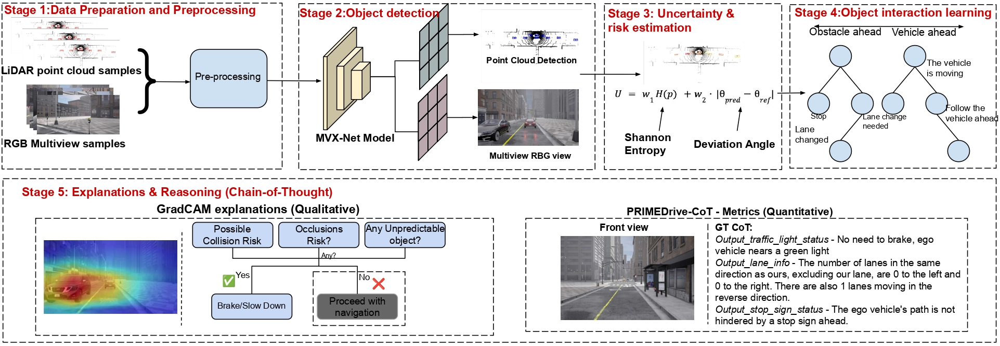

<div align="center">
  <div>
  <h1>Replay to Remember (R2R): An Efficient Uncertainty-driven Unsupervised Continual Learning Framework Using Generative Replay</h1> 

 []()

  </div>

</div>

<div align="center">

<div>
  <a href='https://srirammandalika.github.io/' target='_blank'>Sriram Mandalika</a><sup>1</sup>&emsp;
  <a href='' target='_blank'>Harsha Vardhan</a><sup>1</sup>&emsp;  
  <a href='https://www.srmist.edu.in/faculty/dr-athira-m-nambiar/' target='_blank'>Athira Nambiar</a><sup>1</sup>&emsp;

</div>
<div> <br>
<sup>1</sup>SRM Institute of Science and Technology, Kattankulathur, India - 603203&emsp;


<!--     <a href='' target='_blank'>Enzo Tartaglione</a><sup>1</sup>&emsp;
    <a href='' target='_blank'>Stéphane Lathuilière </a><sup>1</sup> -->


<!-- <sup>2</sup>University of Trento, Italy&emsp; -->
</div>
</div>

<br>

The code repository for "[Replay to Remember (R2R): An Efficient Uncertainty-driven Unsupervised Continual Learning Framework Using Generative Replay]()" in PyTorch.

## Abstract:
Continual Learning entails progressively acquiring knowledge from new data while retaining previously acquired knowledge, thereby mitigating "Catastrophic Forgetting'' in neural networks. Our work presents a novel uncertainty-driven Unsupervised Continual Learning framework using Generative Replay, namely ``Replay to Remember (R2R)''. The proposed R2R architecture efficiently uses unlabelled and synthetic labelled data in a balanced proportion using a cluster-level uncertainty-driven feedback mechanism and a VLM-powered generative replay module. Unlike traditional memory-buffer methods that depend on pretrained models and pseudo-labels, our R2R framework operates without any prior training. It leverages visual features from unlabeled data and adapts continuously using clustering-based uncertainty estimation coupled with dynamic thresholding. Concurrently, a generative replay mechanism along with DeepSeek-R1 powered CLIP VLM produces labelled synthetic data representative of past experiences, resembling biological visual thinking that replays memory to remember and act in new, unseen tasks. Extensive experimental analyses are carried out in CIFAR-10, CIFAR-100, CINIC-10, SVHN and TinyImageNet datasets. Our proposed R2R approach improves knowledge retention, achieving a state-of-the-art performance of 98.13%, 73.06%, 93.41%, 95.18%, 59.74%, respectively, surpassing state-of-the-art performance by over 4.36%.

## Our Proposed Framework:


# Dataset: 
- We used multiple datasets such as CIFAR-10, CIFAR-100, CINIC-10, SVHN and TinyImageNet

Links to the datasets can be found below:

- CIFAR - 10: https://www.cs.toronto.edu/~kriz/cifar.html
- CIFAR - 100: https://www.cs.toronto.edu/~kriz/cifar.html
- CINIC - 100: https://paperswithcode.com/dataset/cinic-10
- SVHN: http://ufldl.stanford.edu/housenumbers/
- TinyImagNet: https://huggingface.co/datasets/zh-plus/tiny-imagenet

## Software requirements:

# Software requirements:
- Numpy, scipy, pytorch, sklearn, matplotlib, pandas

- To download the dependencies: **!pip install -r requirements.txt**

- The code can be run on any PC.

## 📧Contact

If you have any questions, please  contact us at [mc9991@srmist.edu.in](mailto:mc9991@srmist.edu.in).

## BibTeX & Citation

If you find this code useful, please consider citing our work:

```bibtex
@misc{mandalika2025replayrememberr2refficient,
      title={Replay to Remember (R2R): An Efficient Uncertainty-driven Unsupervised Continual Learning Framework Using Generative Replay}, 
      author={Sriram Mandalika and Harsha Vardhan and Athira Nambiar},
      year={2025},
      eprint={2505.04787},
      archivePrefix={arXiv},
      primaryClass={cs.CV},
      url={https://arxiv.org/abs/2505.04787}, 
}
```
